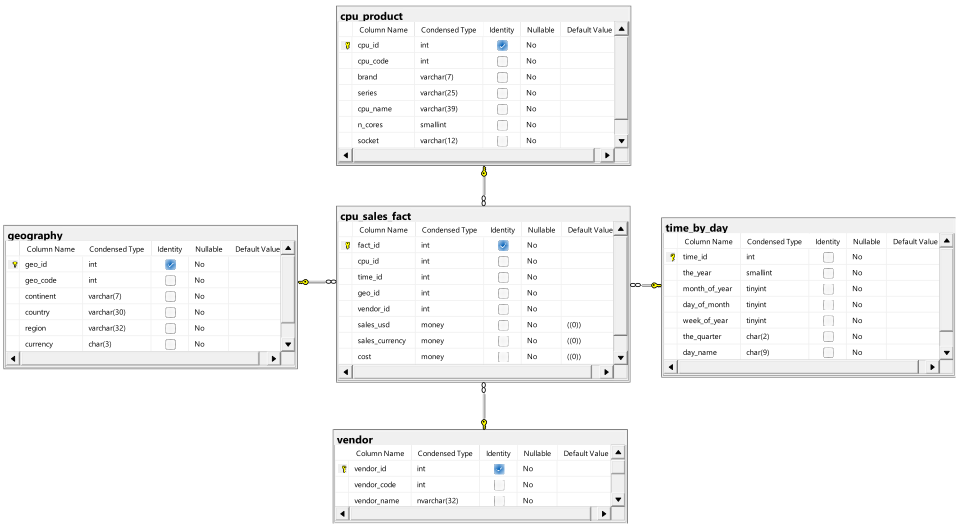
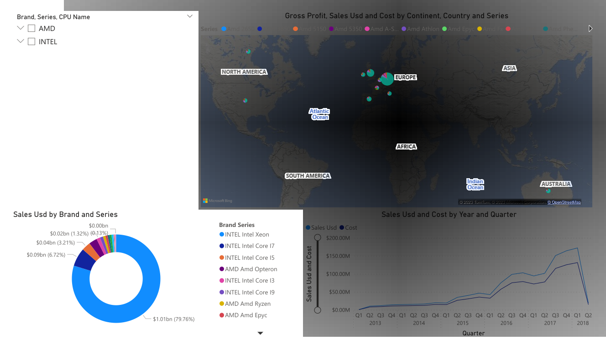
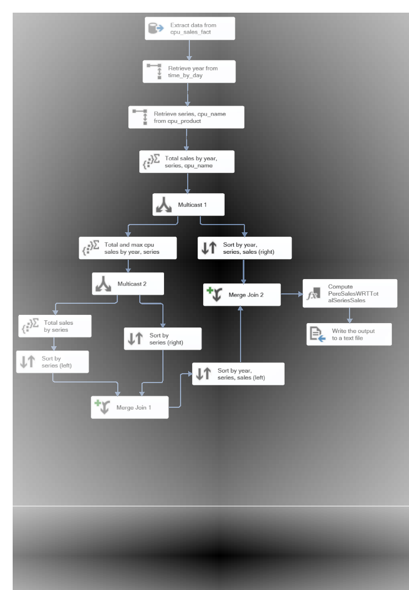

# Laboratory-of-Data-Science
This repository houses a data science project carried out as part of the "Data Science Laboratory" course at the University of Pisa. The primary objective of the project was to demonstrate proficiency in various data management and analysis techniques, focusing specifically on building a data warehouse, implementing an ETL process, building a Data Cube, executing MDX queries, and creating an interactive dashboard.

Among the tools used are: 

  

## Key Tasks summarized

* Data Warehouse Construction and Population: Designing and implementing a robust data warehouse architecture. This involved several steps, such as selecting an appropriate data modeling technique (star schema), creating auxiliary data structures to improve performance, and transforming raw data from various CSV files into a centralized data repository.

* ETL process development: Consists of an ETL process aimed at answering a specific business question by means of the SQL Server Integration Services tool provided by Microsoft.

* Data Cube Creation: To enable multidimensional analysis, a MOLAP cube was created based on the data warehouse. The process involved defining dimensions, user-defined and flat hierarchies leveraging simple or composite columns and named calculations, simple or calculated measures to enable faster analytical queries.

* MDX Query Execution: Leveraging the MOLAP cube to answer a business question using the Multidimensional Expressions query language.

* Interactive Dashboard Creation: The project concludes with the development of an interactive dashboard that provides insightful data visualizations, charts, and graphs derived from the Data Cube.

## Figures 
     
   

